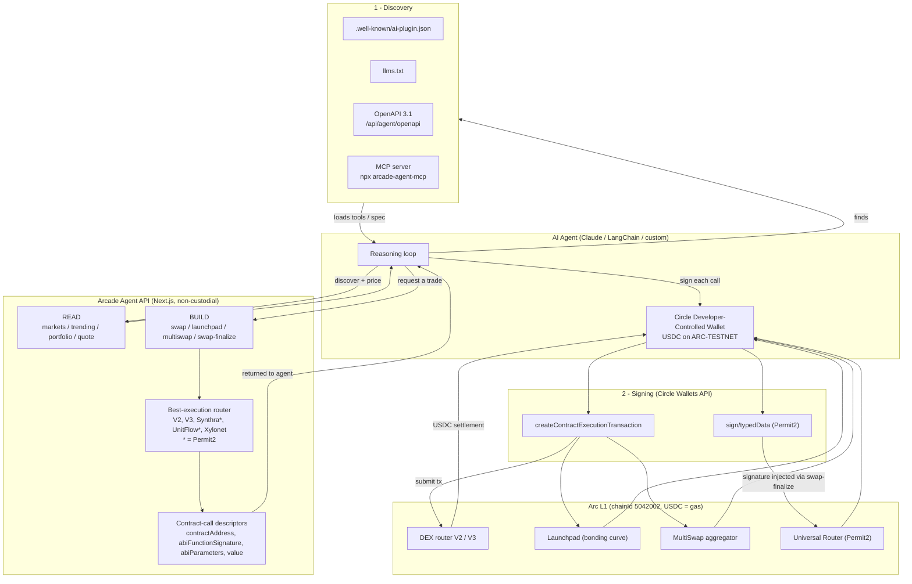

# Arcade Agent layer — architecture

How any third-party AI agent discovers and uses Arcade (USDC-native DEX +
bonding-curve launchpad on Circle's Arc L1). Non-custodial: the agent signs with
its own Circle Wallet; Arcade never holds keys.

## Flow in words

1. **Discover** — an agent (or its operator) finds Arcade via the static
   `.well-known/ai-plugin.json` / `llms.txt`, the OpenAPI spec, or the
   `arcade-agent-mcp` server, and loads the tools.
2. **Read** — `markets`, `trending`, `portfolio`, `quote` give live,
   decision-grade data (prices, market caps, curve progress, `tradeVia`).
3. **Build** — `swap` / `launchpad` / `multiswap` run best-execution and return
   ordered **contract-call descriptors** (plus `minAmountOut`, `slippageBps`,
   `nextStep`). Arcade never signs.
4. **Sign** — the agent feeds each descriptor to Circle
   `createContractExecutionTransaction` with its own wallet. Permit2 venues add a
   `sign/typedData` step, then `swap/finalize` injects the signature.
5. **Settle** — the tx executes on Arc; everything settles in USDC (the native
   gas token), so the agent only ever needs USDC.
